# Awesome Racing Simulation & Video Games 🏎️🏁

  

  
  
  
  
  

## 📌 Top Racing Simulation Video Game Ecosystem 🎮🚗

**Curated List of Commercial SaaS Products & Open-Source GitHub Projects**  
*Focused on Physics-Based Racing, Driving Simulation, Telemetry Tools & Open-Source Racing Engines* ⚙️🛣️

**Last updated: October 2026** 📅

---

Welcome to the ultimate directory for **racing simulation software**, **physics-based driving engines**, **telemetry tools**, and **open-source racing games**. Whether you are looking for high-end professional driver training simulators like *iRacing* and *Assetto Corsa Competizione*, or open-source community titles like *Speed Dreams*, *SuperTuxKart*, and *VDrift*, this list covers the entire racing game technology spectrum! 🏎️💨

---

## 📊 Market Overview & Industry Structure 📈

> 💡 **Estimated Market Size**: The global **racing simulator & sim racing market** is estimated at **$0.95 Billion to $1.22 Billion (2025–2026)**, with broader gaming & hardware simulation categories exceeding **$8.9 Billion**.
>
> ⚖️ **Market Structure**: The sector is **moderately fragmented**. While major corporate publishers (such as Electronic Arts and Sony Interactive Entertainment) control high-budget commercial franchises and official motorsport licenses (F1, WRC, GT3), the market features competitive independent simulation studios (iRacing, Reiza, Sector3) and a thriving hardware/software ecosystem. No single entity holds a winner-take-all monopoly.

---

## 🏢 Commercial SaaS & Hosted Racing Platforms 🏁

| Platform 🎮 | Developer / Parent Company 🏢 | Valuation / Revenue 💰 | Starting Tier Price 💲 | Free Tier / Trial Limits ⏳ | Highlights & Target Audience 🎯 |
| :--- | :--- | :--- | :--- | :--- | :--- |
| **[Sony PlayStation / Polyphony Digital](https://www.gran-turismo.com/)**   *(Gran Turismo 7)* | Sony Interactive Entertainment | **$115B+ Market Cap** (~$85B annual revenue) | **$69.99 base purchase** | **No free tier/trial** (Full paid purchase required on PS4/PS5) | Definitive console racing sim, legendary car collection & tuning culture. |
| **[Electronic Arts (EA)](https://www.ea.com/games/f1/f1-23)**   *(F1 23 / F1 24 / WRC)* | Electronic Arts (Acquired Codemasters for $1.2B) | **$38B+ Market Cap** ($7.53B FY2026 revenue) | **$69.99 base purchase** | **5-hour free trial** via EA Play subscription ($5.99/mo) | Official F1 & WRC franchise, realistic handling, story mode & multiplayer. |
| **[Digital Bros / Kunos Simulazioni](https://www.assettocorsa.net/competizione/)**   *(Assetto Corsa Competizione)* | Digital Bros S.p.A. | **$150M+ Market Cap** (€32M+ AC franchise revenue) | **$39.99 base purchase** | **No free tier/trial** (Occasional Steam Free Weekends - 3 days) | Official SRO GT3/GT4 sim, Unreal Engine 4 visuals & premier force feedback. |
| **[iRacing](https://www.iracing.com/)** | iRacing.com Motorsport Simulations | **$100M+ Estimated Valuation** | **$13.00/month** ($110/year starting plan) | **No free tier/trial** (Promotional 3-month hardware bundles available) | Premier competitive online sim, laser-scanned tracks & official esports standard. |
| **[Sector3 Studios / KW Studios](https://www.raceroom.com/)**   *(RaceRoom Racing Experience)* | KW Automotive GmbH | **$50M+ Parent Revenue** | **$0.00 base game** (Individual tracks/cars from $1.99) | **Unlimited Free Tier** (5 free cars & 3 tracks included forever) | Premier sound design & physics engine, free-to-play model with store add-ons. |
| **[Reiza Studios](https://www.automobilista2.com/)**   *(Automobilista 2)* | Reiza Studios (Independent) | **$10M+ Estimated Valuation** | **$39.99 base purchase** | **No free tier/trial** (Steam 2-hour refund policy applies) | MADNESS Engine physics, dynamic weather & comprehensive South American motorsport. |
| **[Studio 397](https://www.studio-397.com/)**   *(rFactor 2)* | Motorsport Games Inc. | **$8M+ Market Cap** | **$31.99 base purchase** | **No free tier/trial** (Demo removed; purchase required) | Unmatched physics, advanced tire modeling & pro driver-in-the-loop training base. |

---

## 🔓 Open-Source GitHub Racing Projects & Engines 🛠️

Discover top open-source racing simulators, rally engines, kart racers, and physics frameworks.

| Repository 📦 | Stars ⭐ | License 📜 | Description & Category 📝 |
| :--- | :--- | :--- | :--- |
| **[OpenRCT2/OpenRCT2](https://github.com/OpenRCT2/OpenRCT2)** |  | GPL-3.0 | Open-source engine reimplementation of RollerCoaster Tycoon 2 with track & ride racing physics. 🎢 |
| **[SuperTuxKart/stk-code](https://github.com/supertuxkart/stk-code)** |  | GPL-3.0 | 3D open-source arcade kart racer featuring 20+ tracks, online multiplayer & battle modes. 🏎️🍌 |
| **[pioneerdev/pioneer](https://github.com/pioneerdev/pioneer)** |  | GPL-3.0 | Open-world space flight and orbital dynamics simulation engine inspired by Frontier: Elite 2. 🚀 |
| **[RigsOfRods/rigsofrods](https://github.com/RigsOfRods/rigsofrods)** |  | GPL-3.0 | Soft-body physics vehicle simulator supporting trucks, cars, aircraft & watercraft. 🚛 |
| **[f1db/f1db](https://github.com/f1db/f1db)** |  | MIT | Comprehensive open-source database of Formula 1 races, drivers, teams, engines & circuits. 🏎️📊 |
| **[vdrift/vdrift](https://github.com/vdrift/vdrift)** |  | GPL-2.0 | Driving simulation engine designed specifically for drift physics and real-time tire modeling. 💨 |
| **[TriggerRally/server](https://github.com/TriggerRally/server)** |  | MIT | Lightweight 3D rally racing game engine playable directly in modern web browsers. 🌐 |
| **[stuntrally/stuntrally](https://github.com/stuntrally/stuntrally)** |  | GPL-3.0 | 3D rally game featuring 170+ tracks with loops, jumps, pipes, and built-in track editor. 🎢 |
| **[juzzlin/DustRacing2D](https://github.com/juzzlin/DustRacing2D)** |  | GPL-3.0 | 2D overhead tile-based racing game with physics, AI opponents, and level editor. 🏁 |
| **[speed-dreams/speed-dreams](https://github.com/speed-dreams/speed-dreams)** |  | GPL-2.0 | Complete 3D motorsport simulation fork of TORCS featuring 100+ cars & realistic visual effects. 🏎️ |
| **[fmirus/torcs-1.3.7](https://github.com/fmirus/torcs-1.3.7)** |  | GPL-2.0 | The landmark Open Racing Car Simulator engine used extensively for academic AI driving research. 🤖 |

---

## 🤝 How to Contribute 🛠️

We welcome contributions from motorsport fans, game developers, and sim racers! 🏎️

1. **Fork the Repository** 🍴
2. **Add or Edit Entries** in `README.md` following the exact table structure.
3. **Ensure Details are Specific**: Include accurate pricing, free tier limits, developer info, and star badges.
4. **Submit a Pull Request** 🚀 with a brief description of your changes.

---

## ⚠️ Disclaimer 📜

- This repository is a **community-curated list** for informational and educational purposes.
- Force feedback fidelity, telemetry output, and physics accuracy vary between open-source projects and commercial grade simulators.
- Always verify mod files and third-party track downloads from trusted community portals.

---

## 🌟 Support & Sponsorship 🙏

Thank you for exploring the **Awesome Racing Simulation Video Game** repository! If you find this project valuable, please consider supporting us:

- ⭐ **Star this repository** to help others discover it!
- 🔀 **Fork & Share** it with fellow sim racing enthusiasts and game developers.
- ☕ **Buy me a coffee**: Support ongoing maintenance via the [GitHub Sponsor Dashboard](https://github.com/sponsors/ishandutta2007).

---

## 📈 Star History

---

**Made with ❤️ for sim racers, esports drivers, and open-source game developers worldwide.** 🏁
